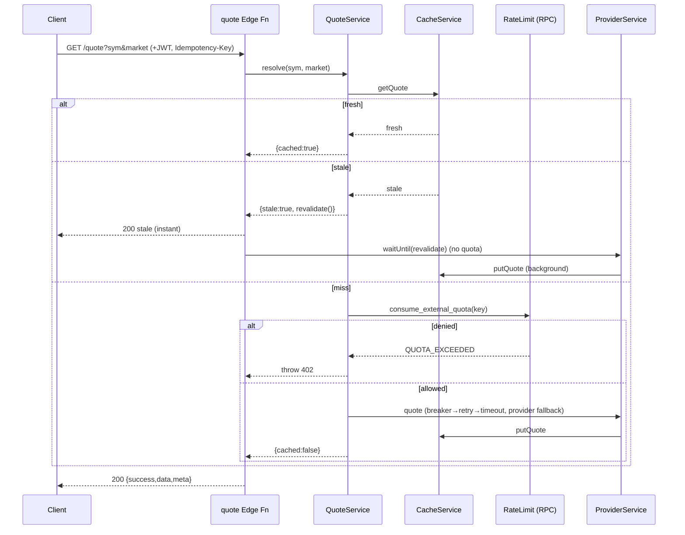
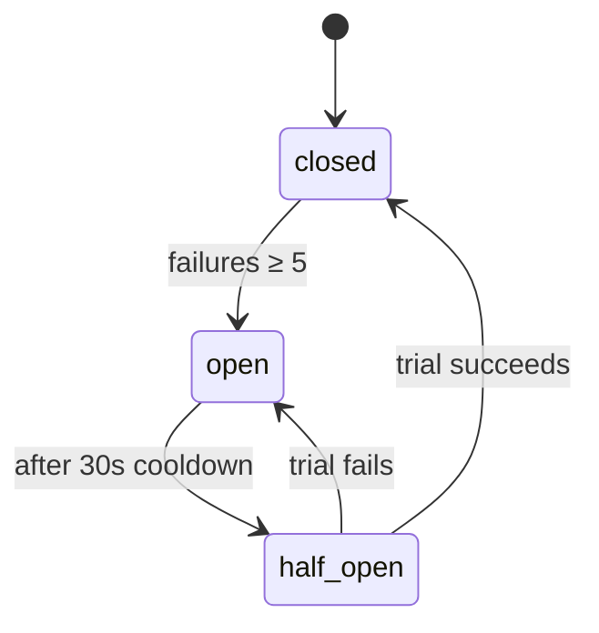

# Reliability & Observability (Phase 4)

How the SymbolUniverse service stays up when upstreams misbehave, and how it's
observed in production.

## Defense in depth

Each outbound provider call is wrapped, innermost → outermost:

```
timeout (http.ts)  →  retry+backoff (retry.ts)  →  circuit breaker (circuit-breaker.ts)
```

- **Timeout** — every `fetchJSON` aborts after 8s, so one hung socket can't pin a
  request.
- **Retry** — transient failures only (`PROVIDER_TIMEOUT`, `PROVIDER_UNAVAILABLE`):
  2 retries, exponential backoff with full jitter (`150ms·2ⁿ`, capped 2s). A bad
  symbol / quota / auth error never retries.
- **Circuit breaker** — per provider, per instance. 5 consecutive failures → OPEN
  (30s); calls fail fast and the orchestrator falls through to the next provider
  instead of eating a timeout every request. After 30s → HALF-OPEN trial → CLOSED
  on success.
- **Provider fallback** — Yahoo → Finnhub → Alpha Vantage; a dead provider is
  skipped, not fatal.
- **Cache fallback / graceful degradation** — a stale quote is served rather than
  erroring; only a true miss with all providers down surfaces an error.

The result: a single upstream outage degrades latency/freshness slightly instead
of cascading into request failures.

### Request flow (quote, with stale-while-revalidate)



### Circuit breaker states



## Observability

Structured JSON logs (one object per line) + metrics-as-log-events, all stamped
with `trace_id` / `route` / `user_id` from an AsyncLocalStorage context set at the
Edge boundary. The console sink in `observability/log.ts` + `metrics.ts` is the
**OpenTelemetry seam** — swap it for an OTel exporter and call sites don't change.

### Metric catalogue

| Metric | Kind | Tags | Meaning |
|--------|------|------|---------|
| `request.duration_ms` | timing | status | end-to-end latency |
| `provider.latency_ms` | timing | provider, op, outcome | per-upstream latency |
| `provider.failure` | counter | provider, op, code | upstream/breaker failures |
| `cache.hit` / `cache.miss` | counter | fn, stale | **cache hit ratio** |
| `quota.consume` | counter | outcome, code | quota charged/denied/unlimited |

Derive in your log backend: cache hit ratio = `cache.hit / (cache.hit+cache.miss)`;
provider health = `rate(provider.failure)` per provider; quota pressure =
`quota.consume{outcome=denied}`.

### What is logged

- `request.ok` / `request.error` (status, error_code) — one per request.
- `provider.search_failed` / `provider.quote_failed` (warn) — per-provider fallthrough.
- Errors go to stderr; info/debug to stdout.

## Failure modes handled

| Failure | Handling |
|---------|----------|
| provider timeout | abort 8s → retry (jittered) → next provider |
| provider 5xx / down | breaker opens after 5 fails → fail fast → next provider |
| all providers down, cached | serve stale (degraded), `meta.stale=true` |
| all providers down, uncached | `SYMBOL_NOT_FOUND` / `PROVIDER_UNAVAILABLE` |
| quota exceeded | `402 QUOTA_EXCEEDED` (no provider call) |
| duplicate / retried request | idempotency key: one charge, replayed response |
| invalid input | `400 INVALID_REQUEST` (no provider call) |

## Known limits (next layers, not built)

- Breaker/metric state is per Edge instance — a shared view needs Redis.
- Background revalidate is best-effort (no queue/retry) — a job queue would make
  it durable.
- Metrics are log-derived — wire the OTel exporter for first-class metrics/traces.
